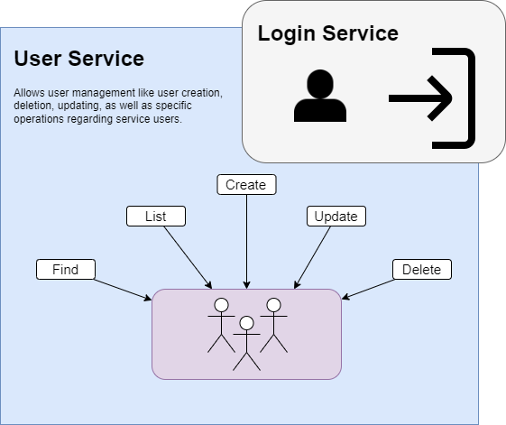
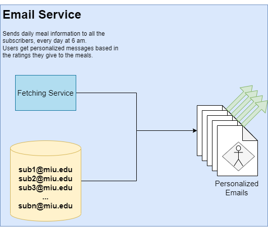
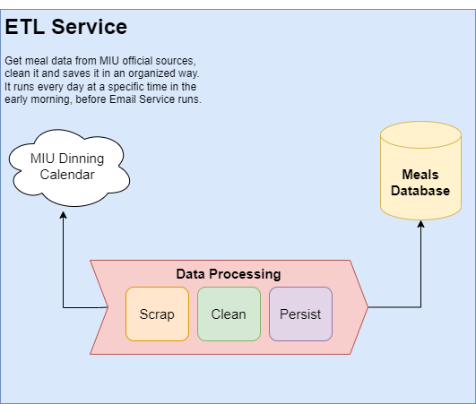
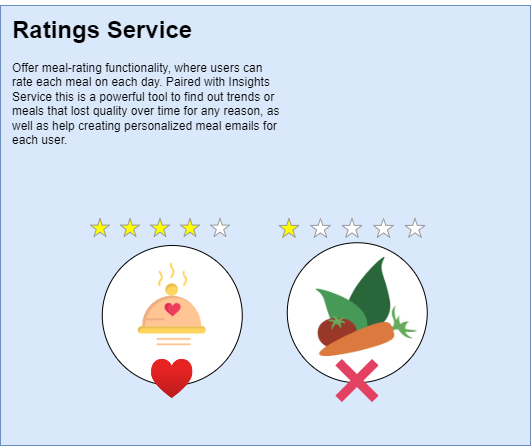

# Project Annapurna
This is a Project Repository for a course CS544-Enterprise Architecture
taught by [Professor Michael Zijlstra](https://manalabs.org/).🧑🏽‍🏫 at MIU 🏫

# How to run
You must start the services in the following order:

1. **Eureka-Server-One:** *9091*
2. **Eureka-Server-Two:** *9092* (optional)
3. **Config-server:** *8000*
4. **Api-gateway-one:** *8080*
5. **Login-Service:** *9090*
6. **User-Service:** *8082*
 

These other services you can start in any order:

8. **Email-Service:** *8081*
9. **ETL-Service:** *8083*
10. **Rating-Service:** *8084*

You also need to setup two environment variables for the email service:
- **GMAIL_USER:** A valid Gmail email address
- **GMAIL_PASSWORD:** The password or an app password for the GMAIL_USER.

# Micro-services overview

1. ### USER-SERVICE
   - **Swagger:** _:8082/swagger-ui.html

2. ### LOGIN-SERVICE
   - **Swagger:** _:9090/swagger-ui.html\

3. ### EMAIL-SERVICE
   - **Swagger:** _:8081/swagger-ui.html\

4. ### ETL-SERVICE
   - **Swagger:** _:8083/swagger-ui.html\

5. ### RATING-SERVICE
   - **Swagger:** _:8084/swagger-ui.html\

# Contributors
- ## Ricardo Macedo Ianelli 
- ## Riwaaz Bahadur Sijapati 
- ## Bijay Shrestha 

# Presentation
Since it was a project for a specific course, we've also created [small presentation](https://docs.google.com/presentation/d/1O-QTDH0kmuehK4BpleJ2WtXOt_wkxDYWWcnGtuHpZyk/edit#slide=id.gc6f80d1ff_0_0). There isn't text in the slides since we prefer to have a more dynamic presentation.

